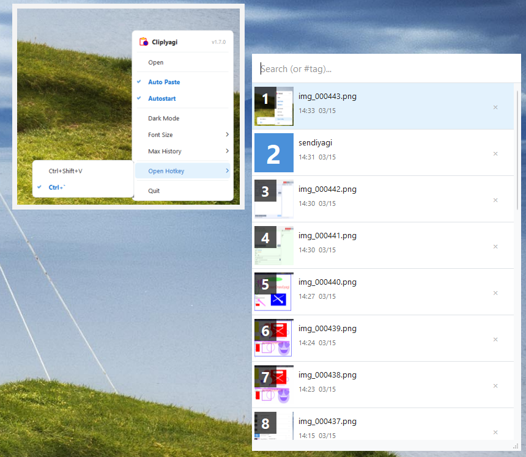

# ClipIyagi(클립이야기) v1.7.0


A **lightweight, fast clipboard history manager** for Windows and Linux.

ClipIyagi automatically saves everything you copy and lets you quickly paste it back with a global shortcut — no matter which app you're in.

---

## ✨ Features

### Clipboard Management
* **Auto-save** — automatically records copied text and images
* **Pin items** — pin important clips to the top of the list (excluded from auto-cleanup)
* **Edit items** — edit saved text content directly
* **Tags / Categories** — assign tags to items and filter with `#tagname`
* **Max history size** — choose 100 / 300 / 500 / 1000 / Unlimited

### Productivity
* **Global hotkey** — open the clipboard list from anywhere (`Ctrl+Shift+V` or `Ctrl+\``)
* **Auto-paste** — automatically pastes into the previously focused window on selection
* **Paste shortcut choice** — `Ctrl+V` (standard) or `Ctrl+Shift+V` (works in terminals too)
* **Number shortcuts** — press `1–9` or `0` to instantly paste that item
* **Real-time search** — filter clipboard history as you type
* **Image preview** — hover over a thumbnail to see the full image
* **Infinite scroll** — smoothly browse large histories
* **Resizable window** — drag to resize to your preferred size

### Appearance
* **Dark mode** — toggle between light and dark themes
* **Font size** — choose 9 / 10 / 12 / 14pt

### System
* **System tray** — always accessible from the tray icon
* **Autostart** — launch automatically on login

---

## 🎮 Keyboard Shortcuts

| Key | Action |
|---|---|
| Ctrl + Shift + V | Open clipboard list |
| Ctrl + ` | Open clipboard list |
| 1 – 9 / 0 | Instantly paste that numbered item |
| ESC | Close list / clear search |
| Right-click | Pin · Edit · Tag · Delete menu |

---

## ⬇ Download

### Windows
Install from the Microsoft Store.
(Store link coming soon)

### Linux
Download the binary from GitHub Releases.

```bash
chmod +x ClipIyagi
./ClipIyagi
```

---

## 🐧 Linux Setup

### Wayland (GNOME) — for auto-paste support

```bash
# Install packages
sudo apt install ydotool wl-clipboard

# Fix uinput permissions (once)
echo 'KERNEL=="uinput", GROUP="input", MODE="0660"' | sudo tee /etc/udev/rules.d/60-uinput.rules
sudo udevadm control --reload-rules && sudo udevadm trigger

# Register ydotoold as a user service (recommended)
mkdir -p ~/.config/systemd/user
cat > ~/.config/systemd/user/ydotoold.service << 'EOF'
[Unit]
Description=ydotool daemon
[Service]
ExecStart=/usr/bin/ydotoold
Restart=always
[Install]
WantedBy=default.target
EOF
systemctl --user enable --now ydotoold.service
```

### X11

```bash
sudo apt install xdotool
```

---

## 🖥 Supported Platforms

* Windows 10 / 11
* Linux (GNOME Wayland / X11)

---

## 👤 Author

IYAGI INC
Email: [iyagicom@gmail.com](mailto:iyagicom@gmail.com)
GitHub: https://github.com/iyagicom

---

## 📜 License

Copyright (c) 2026 IYAGI INC. All rights reserved.

This software is provided as **executable files only**. Source code is not publicly available.

You may use this software for personal and non-commercial purposes.
Redistribution, modification, or reverse engineering is prohibited without explicit written permission from the author.
