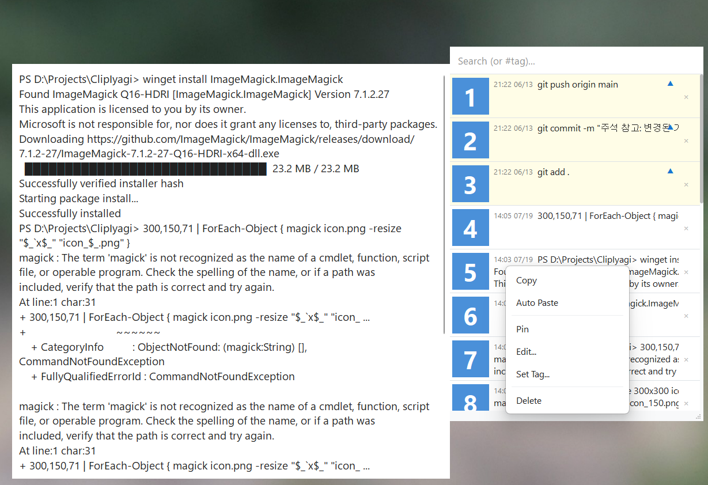
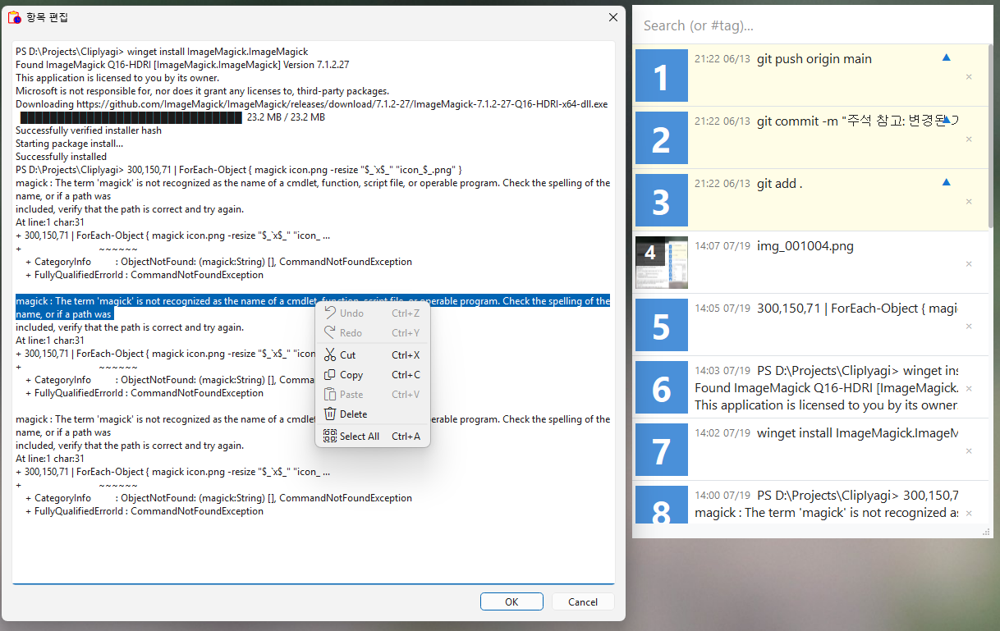
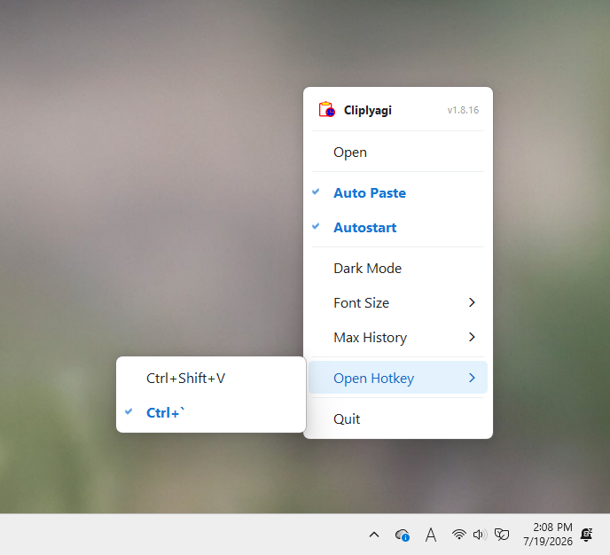

# 클립이야기 (ClipIyagi)

**복사한 것을 다시는 잃어버리지 않습니다. Windows·Linux 클립보드 관리자 — 글자도 이미지도 단축키 하나로.**

[English](README.md) · [한국어](README_ko.md)



## 왜 클립이야기인가

- **복사한 것은 전부 남습니다.** 글자와 이미지를 저절로 기록합니다. 한 시간 전에 복사한 링크도 다시 꺼냅니다.
- **어디서든 단축키 하나.** `Ctrl+Shift+V` 를 누르면 하던 작업 위에 목록이 뜨고, `1`~`9` 를 누르면 바로 붙여 넣어집니다.
- **붙여 넣기까지 해 줍니다.** 항목을 고르면 방금 쓰던 창에 들어갑니다. 터미널에서도 됩니다.
- **자주 쓰는 것은 위에.** 고정하고, 태그를 달고, `#태그` 로 걸러 보고, 그 자리에서 고칩니다.
- **Wayland 에서도 따로 깔 것 없이.** GNOME·KDE Plasma 에서는 xdotool·ydotool 없이 자동 붙여넣기가 됩니다.

## 기능

- 글자·이미지 자동 기록(100 / 300 / 500 / 1000 / 무제한)
- 고정·편집·태그·삭제, 실시간 검색
- 전역 단축키, 숫자 키로 붙여넣기, 직전 창에 자동 붙여넣기
- 붙여넣기 키를 `Ctrl+V` / `Ctrl+Shift+V` 중에서 선택
- 긴 글은 마우스를 올리면 미리보기, 이모지는 컬러로
- 다크 모드, 글자 크기, 창 크기 조절
- 시스템 트레이, 로그인 시 자동 시작

| | |
|---|---|
|  |  |

## 다운로드

**[⬇ 최신 버전 받기](https://github.com/iyagicom/ClipIyagi/releases/latest)**

| 내 시스템 | 받을 파일 |
|---|---|
| Windows 10 / 11 | [Microsoft Store](https://apps.microsoft.com/detail/9N2SL0RVX6CN) |
| Ubuntu 24.04 · 데비안 | **ubuntu24.04** 가 붙은 `.deb` |
| Ubuntu 26.04 | **ubuntu26.04** 가 붙은 `.deb` |
| 페도라 · openSUSE | `.rpm` |
| 아치 · 만자로 | `.pkg.tar.zst` |
| 그 밖의 리눅스 | `.AppImage`(설치 없이 실행) 또는 `.zip` |

```bash
sudo apt install ./clipiyagi_*_amd64.deb     # 우분투 / 데비안
sudo dnf install ./clipiyagi-*.rpm           # 페도라
sudo pacman -U clipiyagi-*.pkg.tar.zst       # 아치
```

리눅스에서 자동 붙여넣기는 X11·GNOME·KDE Plasma 에서 바로 됩니다(GNOME·KDE 는 처음 한 번 허용을 묻습니다). sway·Hyprland 같은 wlroots 계열은 `wtype` 이 깔려 있으면 그것을 씁니다.

## 라이선스

[라이선스](LICENSE) · [개인정보 처리방침](privacy-policy.md)
